# Wasserstein GAN with Gradient Penalty (WGAN-GP)

### Goals
In this notebook, you're going to build a Wasserstein GAN with Gradient Penalty (WGAN-GP) that solves some of the stability issues with the GANs that you have been using up until this point. Specifically, you'll use a special kind of loss function known as the W-loss, where W stands for Wasserstein, and gradient penalties to prevent mode collapse.

*Fun Fact: Wasserstein is named after a mathematician at Penn State, Leonid Vaseršteĭn. You'll see it abbreviated to W (e.g. WGAN, W-loss, W-distance).*

### Learning Objectives
1.   Get hands-on experience building a more stable GAN: Wasserstein GAN with Gradient Penalty (WGAN-GP).
2.   Train the more advanced WGAN-GP model.


## Generator and Critic

You will begin by importing some useful packages, defining visualization functions, building the generator, and building the critic. Since the changes for WGAN-GP are done to the loss function during training, you can simply reuse your previous GAN code for the generator and critic class. Remember that in WGAN-GP, you no longer use a discriminator that classifies fake and real as 0 and 1 but rather a critic that scores images with real numbers.

#### Packages and Visualizations


```python
import torch
from torch import nn
from tqdm.auto import tqdm
from torchvision import transforms
from torchvision.datasets import MNIST
from torchvision.utils import make_grid
from torch.utils.data import DataLoader
import matplotlib.pyplot as plt
torch.manual_seed(0) # Set for testing purposes, please do not change!

def show_tensor_images(image_tensor, num_images=25, size=(1, 28, 28)):
    '''
    Function for visualizing images: Given a tensor of images, number of images, and
    size per image, plots and prints the images in an uniform grid.
    '''
    image_tensor = (image_tensor + 1) / 2
    image_unflat = image_tensor.detach().cpu()
    image_grid = make_grid(image_unflat[:num_images], nrow=5)
    plt.imshow(image_grid.permute(1, 2, 0).squeeze())
    plt.show()

def make_grad_hook():
    '''
    Function to keep track of gradients for visualization purposes, 
    which fills the grads list when using model.apply(grad_hook).
    '''
    grads = []
    def grad_hook(m):
        if isinstance(m, nn.Conv2d) or isinstance(m, nn.ConvTranspose2d):
            grads.append(m.weight.grad)
    return grads, grad_hook
```

#### Generator and Noise


```python
class Generator(nn.Module):
    '''
    Generator Class
    Values:
        z_dim: the dimension of the noise vector, a scalar
        im_chan: the number of channels in the images, fitted for the dataset used, a scalar
              (MNIST is black-and-white, so 1 channel is your default)
        hidden_dim: the inner dimension, a scalar
    '''
    def __init__(self, z_dim=10, im_chan=1, hidden_dim=64):
        super(Generator, self).__init__()
        self.z_dim = z_dim
        # Build the neural network
        self.gen = nn.Sequential(
            self.make_gen_block(z_dim, hidden_dim * 4),
            self.make_gen_block(hidden_dim * 4, hidden_dim * 2, kernel_size=4, stride=1),
            self.make_gen_block(hidden_dim * 2, hidden_dim),
            self.make_gen_block(hidden_dim, im_chan, kernel_size=4, final_layer=True),
        )

    def make_gen_block(self, input_channels, output_channels, kernel_size=3, stride=2, final_layer=False):
        '''
        Function to return a sequence of operations corresponding to a generator block of DCGAN;
        a transposed convolution, a batchnorm (except in the final layer), and an activation.
        Parameters:
            input_channels: how many channels the input feature representation has
            output_channels: how many channels the output feature representation should have
            kernel_size: the size of each convolutional filter, equivalent to (kernel_size, kernel_size)
            stride: the stride of the convolution
            final_layer: a boolean, true if it is the final layer and false otherwise 
                      (affects activation and batchnorm)
        '''
        if not final_layer:
            return nn.Sequential(
                nn.ConvTranspose2d(input_channels, output_channels, kernel_size, stride),
                nn.BatchNorm2d(output_channels),
                nn.ReLU(inplace=True),
            )
        else:
            return nn.Sequential(
                nn.ConvTranspose2d(input_channels, output_channels, kernel_size, stride),
                nn.Tanh(),
            )

    def forward(self, noise):
        '''
        Function for completing a forward pass of the generator: Given a noise tensor,
        returns generated images.
        Parameters:
            noise: a noise tensor with dimensions (n_samples, z_dim)
        '''
        x = noise.view(len(noise), self.z_dim, 1, 1)
        return self.gen(x)

def get_noise(n_samples, z_dim, device='cpu'):
    '''
    Function for creating noise vectors: Given the dimensions (n_samples, z_dim)
    creates a tensor of that shape filled with random numbers from the normal distribution.
    Parameters:
      n_samples: the number of samples to generate, a scalar
      z_dim: the dimension of the noise vector, a scalar
      device: the device type
    '''
    return torch.randn(n_samples, z_dim, device=device)
```

#### Critic


```python
class Critic(nn.Module):
    '''
    Critic Class
    Values:
        im_chan: the number of channels in the images, fitted for the dataset used, a scalar
              (MNIST is black-and-white, so 1 channel is your default)
        hidden_dim: the inner dimension, a scalar
    '''
    def __init__(self, im_chan=1, hidden_dim=64):
        super(Critic, self).__init__()
        self.crit = nn.Sequential(
            self.make_crit_block(im_chan, hidden_dim),
            self.make_crit_block(hidden_dim, hidden_dim * 2),
            self.make_crit_block(hidden_dim * 2, 1, final_layer=True),
        )

    def make_crit_block(self, input_channels, output_channels, kernel_size=4, stride=2, final_layer=False):
        '''
        Function to return a sequence of operations corresponding to a critic block of DCGAN;
        a convolution, a batchnorm (except in the final layer), and an activation (except in the final layer).
        Parameters:
            input_channels: how many channels the input feature representation has
            output_channels: how many channels the output feature representation should have
            kernel_size: the size of each convolutional filter, equivalent to (kernel_size, kernel_size)
            stride: the stride of the convolution
            final_layer: a boolean, true if it is the final layer and false otherwise 
                      (affects activation and batchnorm)
        '''
        if not final_layer:
            return nn.Sequential(
                nn.Conv2d(input_channels, output_channels, kernel_size, stride),
                nn.BatchNorm2d(output_channels),
                nn.LeakyReLU(0.2, inplace=True),
            )
        else:
            return nn.Sequential(
                nn.Conv2d(input_channels, output_channels, kernel_size, stride),
            )

    def forward(self, image):
        '''
        Function for completing a forward pass of the critic: Given an image tensor, 
        returns a 1-dimension tensor representing fake/real.
        Parameters:
            image: a flattened image tensor with dimension (im_chan)
        '''
        crit_pred = self.crit(image)
        return crit_pred.view(len(crit_pred), -1)
```

## Training Initializations
Now you can start putting it all together.
As usual, you will start by setting the parameters:
  *   n_epochs: the number of times you iterate through the entire dataset when training
  *   z_dim: the dimension of the noise vector
  *   display_step: how often to display/visualize the images
  *   batch_size: the number of images per forward/backward pass
  *   lr: the learning rate
  *   beta_1, beta_2: the momentum terms
  *   c_lambda: weight of the gradient penalty
  *   crit_repeats: number of times to update the critic per generator update - there are more details about this in the *Putting It All Together* section
  *   device: the device type

You will also load and transform the MNIST dataset to tensors.


```python
n_epochs = 100
z_dim = 64
display_step = 50
batch_size = 128
lr = 0.0002
beta_1 = 0.5
beta_2 = 0.999
c_lambda = 10
crit_repeats = 5
device = 'cuda'

transform = transforms.Compose([
    transforms.ToTensor(),
    transforms.Normalize((0.5,), (0.5,)),
])

dataloader = DataLoader(
    MNIST('.', download=False, transform=transform),
    batch_size=batch_size,
    shuffle=True)
```

Then, you can initialize your generator, critic, and optimizers.


```python
gen = Generator(z_dim).to(device)
gen_opt = torch.optim.Adam(gen.parameters(), lr=lr, betas=(beta_1, beta_2))
crit = Critic().to(device) 
crit_opt = torch.optim.Adam(crit.parameters(), lr=lr, betas=(beta_1, beta_2))

def weights_init(m):
    if isinstance(m, nn.Conv2d) or isinstance(m, nn.ConvTranspose2d):
        torch.nn.init.normal_(m.weight, 0.0, 0.02)
    if isinstance(m, nn.BatchNorm2d):
        torch.nn.init.normal_(m.weight, 0.0, 0.02)
        torch.nn.init.constant_(m.bias, 0)
gen = gen.apply(weights_init)
crit = crit.apply(weights_init)

```

## Gradient Penalty
Calculating the gradient penalty can be broken into two functions: (1) compute the gradient with respect to the images and (2) compute the gradient penalty given the gradient.

You can start by getting the gradient. The gradient is computed by first creating a mixed image. This is done by weighing the fake and real image using epsilon and then adding them together. Once you have the intermediate image, you can get the critic's output on the image. Finally, you compute the gradient of the critic score's on the mixed images (output) with respect to the pixels of the mixed images (input). You will need to fill in the code to get the gradient wherever you see *None*. There is a test function in the next block for you to test your solution.


```python
# UNQ_C1 (UNIQUE CELL IDENTIFIER, DO NOT EDIT)
# GRADED FUNCTION: get_gradient
def get_gradient(crit, real, fake, epsilon):
    '''
    Return the gradient of the critic's scores with respect to mixes of real and fake images.
    Parameters:
        crit: the critic model
        real: a batch of real images
        fake: a batch of fake images
        epsilon: a vector of the uniformly random proportions of real/fake per mixed image
    Returns:
        gradient: the gradient of the critic's scores, with respect to the mixed image
    '''
    # Mix the images together
    mixed_images = real * epsilon + fake * (1 - epsilon)

    # Calculate the critic's scores on the mixed images
    mixed_scores = crit(mixed_images)
    
    # Take the gradient of the scores with respect to the images
    gradient = torch.autograd.grad(
        # Note: You need to take the gradient of outputs with respect to inputs.
        # This documentation may be useful, but it should not be necessary:
        # https://pytorch.org/docs/stable/autograd.html#torch.autograd.grad
        #### START CODE HERE ####
        inputs=mixed_images,
        outputs=mixed_scores,
        #### END CODE HERE ####
        # These other parameters have to do with the pytorch autograd engine works
        grad_outputs=torch.ones_like(mixed_scores), 
        create_graph=True,
        retain_graph=True,
    )[0]
    return gradient

```


```python
# UNIT TEST
# DO NOT MODIFY THIS
def test_get_gradient(image_shape):
    real = torch.randn(*image_shape, device=device) + 1
    fake = torch.randn(*image_shape, device=device) - 1
    epsilon_shape = [1 for _ in image_shape]
    epsilon_shape[0] = image_shape[0]
    epsilon = torch.rand(epsilon_shape, device=device).requires_grad_()
    gradient = get_gradient(crit, real, fake, epsilon)
    assert tuple(gradient.shape) == image_shape
    assert gradient.max() > 0
    assert gradient.min() < 0
    return gradient

gradient = test_get_gradient((256, 1, 28, 28))
print("Success!")
```

    Success!


The second function you need to complete is to compute the gradient penalty given the gradient. First, you calculate the magnitude of each image's gradient. The magnitude of a gradient is also called the norm. Then, you calculate the penalty by squaring the distance between each magnitude and the ideal norm of 1 and taking the mean of all the squared distances.

Again, you will need to fill in the code wherever you see *None*. There are hints below that you can view if you need help and there is a test function in the next block for you to test your solution.

<details>

<summary>
<font size="3" color="green">
<b>Optional hints for <code><font size="4">gradient_penalty</font></code></b>
</font>
</summary>


1.   Make sure you take the mean at the end.
2.   Note that the magnitude of each gradient has already been calculated for you.

</details>


```python
# UNQ_C2 (UNIQUE CELL IDENTIFIER, DO NOT EDIT)
# GRADED FUNCTION: gradient_penalty
def gradient_penalty(gradient):
    '''
    Return the gradient penalty, given a gradient.
    Given a batch of image gradients, you calculate the magnitude of each image's gradient
    and penalize the mean quadratic distance of each magnitude to 1.
    Parameters:
        gradient: the gradient of the critic's scores, with respect to the mixed image
    Returns:
        penalty: the gradient penalty
    '''
    # Flatten the gradients so that each row captures one image
    gradient = gradient.view(len(gradient), -1)

    # Calculate the magnitude of every row
    gradient_norm = gradient.norm(2, dim=1)
    
    # Penalize the mean squared distance of the gradient norms from 1
    #### START CODE HERE ####
    penalty = torch.mean((gradient_norm - 1)**2)
    #### END CODE HERE ####
    return penalty
```


```python
# UNIT TEST
def test_gradient_penalty(image_shape):
    bad_gradient = torch.zeros(*image_shape)
    bad_gradient_penalty = gradient_penalty(bad_gradient)
    assert torch.isclose(bad_gradient_penalty, torch.tensor(1.))

    image_size = torch.prod(torch.Tensor(image_shape[1:]))
    good_gradient = torch.ones(*image_shape) / torch.sqrt(image_size)
    good_gradient_penalty = gradient_penalty(good_gradient)
    assert torch.isclose(good_gradient_penalty, torch.tensor(0.))

    random_gradient = test_get_gradient(image_shape)
    random_gradient_penalty = gradient_penalty(random_gradient)
    assert torch.abs(random_gradient_penalty - 1) < 0.1

test_gradient_penalty((256, 1, 28, 28))
print("Success!")
```

    Success!


## Losses
Next, you need to calculate the loss for the generator and the critic.

For the generator, the loss is calculated by maximizing the critic's prediction on the generator's fake images. The argument has the scores for all fake images in the batch, but you will use the mean of them.

There are optional hints below and a test function in the next block for you to test your solution.

<details><summary><font size="3" color="green"><b>Optional hints for <code><font size="4">get_gen_loss</font></code></b></font></summary>

1. This can be written in one line.
2. This is the negative of the mean of the critic's scores.

</details>


```python
# UNQ_C3 (UNIQUE CELL IDENTIFIER, DO NOT EDIT)
# GRADED FUNCTION: get_gen_loss
def get_gen_loss(crit_fake_pred):
    '''
    Return the loss of a generator given the critic's scores of the generator's fake images.
    Parameters:
        crit_fake_pred: the critic's scores of the fake images
    Returns:
        gen_loss: a scalar loss value for the current batch of the generator
    '''
    #### START CODE HERE ####
    gen_loss = -1. * torch.mean(crit_fake_pred)
    #### END CODE HERE ####
    return gen_loss
```


```python
# UNIT TEST
assert torch.isclose(
    get_gen_loss(torch.tensor(1.)), torch.tensor(-1.0)
)

assert torch.isclose(
    get_gen_loss(torch.rand(10000)), torch.tensor(-0.5), 0.05
)

print("Success!")
```

    Success!


For the critic, the loss is calculated by maximizing the distance between the critic's predictions on the real images and the predictions on the fake images while also adding a gradient penalty. The gradient penalty is weighed according to lambda. The arguments are the scores for all the images in the batch, and you will use the mean of them.

There are hints below if you get stuck and a test function in the next block for you to test your solution.

<details><summary><font size="3" color="green"><b>Optional hints for <code><font size="4">get_crit_loss</font></code></b></font></summary>

1. The higher the mean fake score, the higher the critic's loss is.
2. What does this suggest about the mean real score?
3. The higher the gradient penalty, the higher the critic's loss is, proportional to lambda.


</details>


```python
# UNQ_C4 (UNIQUE CELL IDENTIFIER, DO NOT EDIT)
# GRADED FUNCTION: get_crit_loss
def get_crit_loss(crit_fake_pred, crit_real_pred, gp, c_lambda):
    '''
    Return the loss of a critic given the critic's scores for fake and real images,
    the gradient penalty, and gradient penalty weight.
    Parameters:
        crit_fake_pred: the critic's scores of the fake images
        crit_real_pred: the critic's scores of the real images
        gp: the unweighted gradient penalty
        c_lambda: the current weight of the gradient penalty 
    Returns:
        crit_loss: a scalar for the critic's loss, accounting for the relevant factors
    '''
    #### START CODE HERE ####
    crit_loss =  torch.mean(crit_fake_pred) - torch.mean(crit_real_pred) + c_lambda * gp
    #### END CODE HERE ####
    return crit_loss
```


```python
# UNIT TEST
assert torch.isclose(
    get_crit_loss(torch.tensor(1.), torch.tensor(2.), torch.tensor(3.), 0.1),
    torch.tensor(-0.7)
)
assert torch.isclose(
    get_crit_loss(torch.tensor(20.), torch.tensor(-20.), torch.tensor(2.), 10),
    torch.tensor(60.)
)

print("Success!")
```

    Success!


## Putting It All Together
Before you put everything together, there are a few things to note.
1.   Even on GPU, the **training will run more slowly** than previous labs because the gradient penalty requires you to compute the gradient of a gradient -- this means potentially a few minutes per epoch! For best results, run this for as long as you can while on GPU.
2.   One important difference from earlier versions is that you will **update the critic multiple times** every time you update the generator This helps prevent the generator from overpowering the critic. Sometimes, you might see the reverse, with the generator updated more times than the critic. This depends on architectural (e.g. the depth and width of the network) and algorithmic choices (e.g. which loss you're using). 
3.   WGAN-GP isn't necessarily meant to improve overall performance of a GAN, but just **increases stability** and avoids mode collapse. In general, a WGAN will be able to train in a much more stable way than the vanilla DCGAN from last assignment, though it will generally run a bit slower. You should also be able to train your model for more epochs without it collapsing.


<!-- Once again, be warned that this runs very slowly on a CPU. One way to run this more quickly is to download the .ipynb and upload it to Google Drive, then open it with Google Colab and make the runtime type GPU and replace
`device = "cpu"`
with
`device = "cuda"`
and make sure that your `get_noise` function uses the right device.  -->

Here is a snapshot of what your WGAN-GP outputs should resemble:


```python
import matplotlib.pyplot as plt

cur_step = 0
generator_losses = []
critic_losses = []
for epoch in range(n_epochs):
    # Dataloader returns the batches
    for real, _ in tqdm(dataloader):
        cur_batch_size = len(real)
        real = real.to(device)

        mean_iteration_critic_loss = 0
        for _ in range(crit_repeats):
            ### Update critic ###
            crit_opt.zero_grad()
            fake_noise = get_noise(cur_batch_size, z_dim, device=device)
            fake = gen(fake_noise)
            crit_fake_pred = crit(fake.detach())
            crit_real_pred = crit(real)

            epsilon = torch.rand(len(real), 1, 1, 1, device=device, requires_grad=True)
            gradient = get_gradient(crit, real, fake.detach(), epsilon)
            gp = gradient_penalty(gradient)
            crit_loss = get_crit_loss(crit_fake_pred, crit_real_pred, gp, c_lambda)

            # Keep track of the average critic loss in this batch
            mean_iteration_critic_loss += crit_loss.item() / crit_repeats
            # Update gradients
            crit_loss.backward(retain_graph=True)
            # Update optimizer
            crit_opt.step()
        critic_losses += [mean_iteration_critic_loss]

        ### Update generator ###
        gen_opt.zero_grad()
        fake_noise_2 = get_noise(cur_batch_size, z_dim, device=device)
        fake_2 = gen(fake_noise_2)
        crit_fake_pred = crit(fake_2)
        
        gen_loss = get_gen_loss(crit_fake_pred)
        gen_loss.backward()

        # Update the weights
        gen_opt.step()

        # Keep track of the average generator loss
        generator_losses += [gen_loss.item()]

        ### Visualization code ###
        if cur_step % display_step == 0 and cur_step > 0:
            gen_mean = sum(generator_losses[-display_step:]) / display_step
            crit_mean = sum(critic_losses[-display_step:]) / display_step
            print(f"Step {cur_step}: Generator loss: {gen_mean}, critic loss: {crit_mean}")
            show_tensor_images(fake)
            show_tensor_images(real)
            step_bins = 20
            num_examples = (len(generator_losses) // step_bins) * step_bins
            plt.plot(
                range(num_examples // step_bins), 
                torch.Tensor(generator_losses[:num_examples]).view(-1, step_bins).mean(1),
                label="Generator Loss"
            )
            plt.plot(
                range(num_examples // step_bins), 
                torch.Tensor(critic_losses[:num_examples]).view(-1, step_bins).mean(1),
                label="Critic Loss"
            )
            plt.legend()
            plt.show()

        cur_step += 1

```


    HBox(children=(FloatProgress(value=0.0, max=469.0), HTML(value='')))


    Step 50: Generator loss: -0.08921420384198427, critic loss: 1.8831281597912308


    Step 100: Generator loss: 0.9910049936175347, critic loss: -2.0206484434604643


    Step 150: Generator loss: 3.046200919151306, critic loss: -11.298576456069943


    Step 200: Generator loss: 1.9648561203479766, critic loss: -28.713224487304682


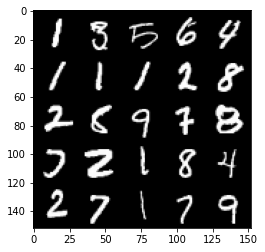


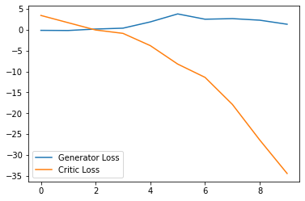


    Step 250: Generator loss: 1.615120728611946, critic loss: -55.80875505065917


    Step 300: Generator loss: 2.8086279916763304, critic loss: -90.0936875


    Step 350: Generator loss: 6.6634070634841915, critic loss: -131.57128985595705


    Step 400: Generator loss: 11.841998767852782, critic loss: -179.63054962158202


    Step 450: Generator loss: 15.344743099212646, critic loss: -226.48242974853514


    


    HBox(children=(FloatProgress(value=0.0, max=469.0), HTML(value='')))


    Step 500: Generator loss: 19.01122001647949, critic loss: -279.23986126708985


    Step 550: Generator loss: 22.643907604217528, critic loss: -329.1926704711914


    Step 600: Generator loss: 10.9468537068367, critic loss: -337.03613214111317


    Step 650: Generator loss: 0.29342069387435915, critic loss: -282.8964716491699


    Step 700: Generator loss: -10.983209661841393, critic loss: -233.03167108154304


    Step 750: Generator loss: -10.81807785987854, critic loss: -204.6148975830078


    Step 800: Generator loss: 0.59345518887043, critic loss: -123.35655097198482


    Step 850: Generator loss: -12.356699594259261, critic loss: -139.1475469970703


    Step 900: Generator loss: -4.773474552631378, critic loss: -43.391711318969726


    


    HBox(children=(FloatProgress(value=0.0, max=469.0), HTML(value='')))


    Step 950: Generator loss: -39.048114286661146, critic loss: -116.28293243408201


    Step 1000: Generator loss: -36.18996314048767, critic loss: -94.15679683685303


    Step 1050: Generator loss: -24.65136296749115, critic loss: -89.51137709045412


    Step 1100: Generator loss: -32.54520573973656, critic loss: -39.82132741546629


    Step 1150: Generator loss: 2.7156317329406736, critic loss: -5.445600322723387


    Step 1200: Generator loss: -36.49390377521515, critic loss: -65.9989951324463


    Step 1250: Generator loss: -6.092022314071655, critic loss: 1.9601769561767506


    Step 1300: Generator loss: 17.928531188964843, critic loss: 26.649888221740724


    Step 1350: Generator loss: 20.14070873260498, critic loss: 39.757784774780276


    Step 1400: Generator loss: 20.83430950164795, critic loss: 27.006047061920164


    


    HBox(children=(FloatProgress(value=0.0, max=469.0), HTML(value='')))


    Step 1450: Generator loss: 22.07602195739746, critic loss: 20.33825241470337


    Step 1500: Generator loss: 22.679368324279785, critic loss: 32.26377305603028


    Step 1550: Generator loss: 21.543437423706056, critic loss: 51.227098556518555


    Step 1600: Generator loss: 18.704231147766112, critic loss: 39.15597252655029


    Step 1650: Generator loss: 17.865181427001954, critic loss: 21.55395868301391


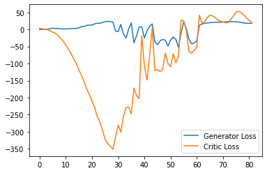


    Step 1700: Generator loss: 18.9741646194458, critic loss: 11.251179721832274


    Step 1750: Generator loss: 19.832909126281738, critic loss: 6.178790395736696


    Step 1800: Generator loss: 19.7320858001709, critic loss: 2.2933278121948244


    Step 1850: Generator loss: 18.630216789245605, critic loss: -0.05408877468109131


    


    HBox(children=(FloatProgress(value=0.0, max=469.0), HTML(value='')))


    Step 1900: Generator loss: 17.853739738464355, critic loss: -1.9321029586791993


    Step 1950: Generator loss: 17.81026798248291, critic loss: -3.6949886760711674


    Step 2000: Generator loss: 17.761905784606935, critic loss: -5.694157825469971


    Step 2050: Generator loss: 19.012782211303712, critic loss: -7.957532529830933


    Step 2100: Generator loss: 20.220277938842774, critic loss: -8.964875978469847


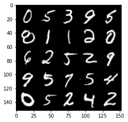


    Step 2150: Generator loss: 21.793281593322753, critic loss: -9.589056808471678


    Step 2200: Generator loss: 23.777834320068358, critic loss: -11.204513425827026


    Step 2250: Generator loss: 25.60374683380127, critic loss: -13.55532264137268


    Step 2300: Generator loss: 26.666469345092775, critic loss: -15.503362087249755


    


    HBox(children=(FloatProgress(value=0.0, max=469.0), HTML(value='')))


    Step 2350: Generator loss: 28.574446182250977, critic loss: -17.040301713943485


    Step 2400: Generator loss: 29.376011466979982, critic loss: -17.610908866882323


    Step 2450: Generator loss: 29.95771415710449, critic loss: -19.20072966766357


    Step 2500: Generator loss: 32.90923027038574, critic loss: -20.993191062927245


    Step 2550: Generator loss: 31.34291130065918, critic loss: -17.45489587497711


    Step 2600: Generator loss: 32.966843109130856, critic loss: -21.94545089149475


    Step 2650: Generator loss: 33.40266414642334, critic loss: -22.9198738117218


    Step 2700: Generator loss: 34.30109714508057, critic loss: -23.066707313537613


    Step 2750: Generator loss: 34.61113380432129, critic loss: -17.36830479097366


    Step 2800: Generator loss: 33.29627773284912, critic loss: -2.576256610870362


    


    HBox(children=(FloatProgress(value=0.0, max=469.0), HTML(value='')))


    Step 2850: Generator loss: 29.558516998291015, critic loss: -3.051739415168764


    Step 2900: Generator loss: 26.49561180114746, critic loss: -7.578926792144776


    Step 2950: Generator loss: 29.630672569274903, critic loss: -17.352051138401027


    Step 3000: Generator loss: 35.99958890914917, critic loss: -3.8786504755020137


    Step 3050: Generator loss: 32.82471012115479, critic loss: -15.410893178939823


    Step 3100: Generator loss: 35.89292545318604, critic loss: -11.659702900886542


    Step 3150: Generator loss: 32.24928127288818, critic loss: -21.518912685394287


    Step 3200: Generator loss: 35.46997859954834, critic loss: -22.931143020629882


    Step 3250: Generator loss: 37.7632731628418, critic loss: -16.99604215812683


    


    HBox(children=(FloatProgress(value=0.0, max=469.0), HTML(value='')))


    Step 3300: Generator loss: 38.334139556884764, critic loss: -14.334082129478452


    Step 3350: Generator loss: 37.13550666809082, critic loss: -22.36182120037079


    Step 3400: Generator loss: 38.833131294250485, critic loss: -23.527738759994506


    Step 3450: Generator loss: 40.899076232910154, critic loss: -13.445384818077084


    Step 3500: Generator loss: 40.24483642578125, critic loss: -5.536909059524536


    Step 3550: Generator loss: 34.13941074371338, critic loss: -21.115789493560797


    Step 3600: Generator loss: 39.02042205810547, critic loss: -16.819884380340575


    Step 3650: Generator loss: 42.37631980895996, critic loss: -15.900618944168095


    Step 3700: Generator loss: 44.59690788269043, critic loss: -10.957927131652834


    Step 3750: Generator loss: 40.69034877777099, critic loss: -20.309734083175663


    


    HBox(children=(FloatProgress(value=0.0, max=469.0), HTML(value='')))


    Step 3800: Generator loss: 47.231308479309085, critic loss: -6.303932723999023


    Step 3850: Generator loss: 43.24249839782715, critic loss: -16.592897315025333


    Step 3900: Generator loss: 43.93731185913086, critic loss: -20.33991699409485


    Step 3950: Generator loss: 47.979606552124025, critic loss: -9.223579836845397


    Step 4000: Generator loss: 46.665524368286135, critic loss: -7.325505867004393


    Step 4050: Generator loss: 43.50457946777344, critic loss: -19.599961451530458


    Step 4100: Generator loss: 48.575121307373045, critic loss: -12.0803477487564


    Step 4150: Generator loss: 50.74765518188477, critic loss: -12.139481350898743


    Step 4200: Generator loss: 48.069759902954104, critic loss: -20.85440789413452


    


    HBox(children=(FloatProgress(value=0.0, max=469.0), HTML(value='')))


    Step 4250: Generator loss: 55.02804941177368, critic loss: -10.325732482910155


    Step 4300: Generator loss: 49.63911407470703, critic loss: -18.507485795021058


    Step 4350: Generator loss: 51.40134284973144, critic loss: -20.766491333961486


    Step 4400: Generator loss: 53.89939666748047, critic loss: -18.530056619644167


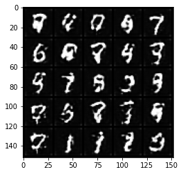


    Step 4450: Generator loss: 61.22015647888183, critic loss: -7.963024959564209


    Step 4500: Generator loss: 63.189253387451174, critic loss: -3.5767962894439718


    Step 4550: Generator loss: 53.97570510864258, critic loss: -13.213317111015323


    Step 4600: Generator loss: 54.18066619873047, critic loss: -18.101094491958612


    Step 4650: Generator loss: 63.074241638183594, critic loss: -9.517001467704775


    


    HBox(children=(FloatProgress(value=0.0, max=469.0), HTML(value='')))


    Step 4700: Generator loss: 65.33966354370118, critic loss: -5.796388601303102


    Step 4750: Generator loss: 57.94232627868652, critic loss: -19.104323853015902


    Step 4800: Generator loss: 61.99587738037109, critic loss: -14.573363418340687


    Step 4850: Generator loss: 62.91675193786621, critic loss: -18.941992817878724


    Step 4900: Generator loss: 62.570198440551756, critic loss: -18.47068563747406


    Step 4950: Generator loss: 66.52637870788574, critic loss: -18.094282247066502


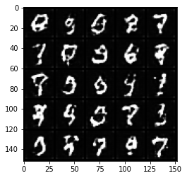


    Step 5000: Generator loss: 66.16911491394043, critic loss: -9.031688045501712


    Step 5050: Generator loss: 63.82594581604004, critic loss: -17.67154801368714


    Step 5100: Generator loss: 66.34983924865723, critic loss: -17.168054577827455


    Step 5150: Generator loss: 66.78400695800781, critic loss: -18.803219132423404


    


    HBox(children=(FloatProgress(value=0.0, max=469.0), HTML(value='')))


    Step 5200: Generator loss: 67.49511436462403, critic loss: -15.756955276489258


    Step 5250: Generator loss: 72.89446716308593, critic loss: -10.822006483078


    Step 5300: Generator loss: 70.03119827270508, critic loss: -17.11750562953949


    Step 5350: Generator loss: 70.34807327270508, critic loss: -15.545968837738037


    Step 5400: Generator loss: 74.98057540893555, critic loss: -15.267065300941464


    Step 5450: Generator loss: 78.19376853942872, critic loss: -6.081193484306335


    Step 5500: Generator loss: 73.40428443908691, critic loss: -16.29325572872161


    Step 5550: Generator loss: 72.58103828430175, critic loss: -17.578088739871976


    Step 5600: Generator loss: 71.61492507934571, critic loss: -20.735977544784546


    


    HBox(children=(FloatProgress(value=0.0, max=469.0), HTML(value='')))


    Step 5650: Generator loss: 82.64605766296387, critic loss: -4.906936118602752


    Step 5700: Generator loss: 83.23922592163086, critic loss: -3.710829990386963


    Step 5750: Generator loss: 77.58529884338378, critic loss: -8.36132246398926


    Step 5800: Generator loss: 80.52659301757812, critic loss: -12.004045170784


    Step 5850: Generator loss: 76.7947930908203, critic loss: -16.625511860847475


    Step 5900: Generator loss: 82.44211212158203, critic loss: -9.15983170700073


    Step 5950: Generator loss: 79.4135498046875, critic loss: -13.162193954467773


    Step 6000: Generator loss: 78.07337539672852, critic loss: -17.067728280067445


    Step 6050: Generator loss: 88.3516000366211, critic loss: 1.8829628233909608


    


    HBox(children=(FloatProgress(value=0.0, max=469.0), HTML(value='')))


    Step 6100: Generator loss: 87.18871002197265, critic loss: -2.4111183948516848


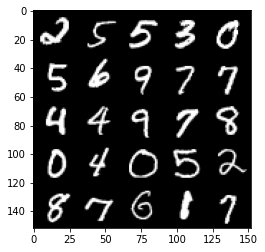


    Step 6150: Generator loss: 85.98255966186524, critic loss: -2.65972613620758


    Step 6200: Generator loss: 84.67106185913086, critic loss: -2.9461547098159797


    Step 6250: Generator loss: 83.24468124389648, critic loss: -3.2197943811416616


    Step 6300: Generator loss: 79.76938972473144, critic loss: -4.6463210043907175


    Step 6350: Generator loss: 84.55428466796874, critic loss: -4.906443878173828


    Step 6400: Generator loss: 77.9591081237793, critic loss: -15.462328550338743


    Step 6450: Generator loss: 80.21318756103516, critic loss: -12.29338437652588


    Step 6500: Generator loss: 79.44552429199219, critic loss: -16.175099219322203


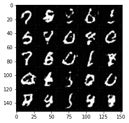


    Step 6550: Generator loss: 81.64179595947266, critic loss: -13.96830569505691


    


    HBox(children=(FloatProgress(value=0.0, max=469.0), HTML(value='')))


    Step 6600: Generator loss: 80.00523315429687, critic loss: -17.837730355262753


    Step 6650: Generator loss: 89.2041259765625, critic loss: -12.506926847219471


    Step 6700: Generator loss: 83.99822830200195, critic loss: -15.094380576133728


    Step 6750: Generator loss: 85.8144744873047, critic loss: -2.740171830177307


    Step 6800: Generator loss: 84.0900946044922, critic loss: -5.654044689059258


    Step 6850: Generator loss: 82.74181716918946, critic loss: -17.15608220529556


    Step 6900: Generator loss: 82.73575180053712, critic loss: -14.952022145271304


    Step 6950: Generator loss: 87.376572265625, critic loss: -14.130860904693602


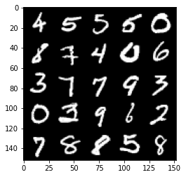


    Step 7000: Generator loss: 80.39826049804688, critic loss: -21.454723683595653


    


    HBox(children=(FloatProgress(value=0.0, max=469.0), HTML(value='')))


    Step 7050: Generator loss: 85.81038146972656, critic loss: -13.878658952236174


    Step 7100: Generator loss: 81.9545980834961, critic loss: -18.298397474288937


    Step 7150: Generator loss: 89.20391998291015, critic loss: -7.00580557346344


    Step 7200: Generator loss: 88.05260223388672, critic loss: -9.111673758506775


    Step 7250: Generator loss: 90.50775436401368, critic loss: -12.744439420700074


    Step 7300: Generator loss: 87.51148696899413, critic loss: -16.15311605501175


    Step 7350: Generator loss: 84.04835693359375, critic loss: -17.066434749126433


    Step 7400: Generator loss: 84.0791812133789, critic loss: -18.158744814395902


    Step 7450: Generator loss: 86.21021224975586, critic loss: -15.110127362012863


    Step 7500: Generator loss: 88.12759887695313, critic loss: -16.239437568187714


    


    HBox(children=(FloatProgress(value=0.0, max=469.0), HTML(value='')))


    Step 7550: Generator loss: 88.66850402832031, critic loss: -10.484792006969451


    Step 7600: Generator loss: 86.94520812988281, critic loss: -18.572328203201298


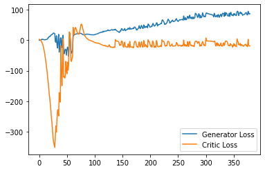


    Step 7650: Generator loss: 89.63778228759766, critic loss: -18.47172679758072


    Step 7700: Generator loss: 97.44354064941406, critic loss: -20.024252505302435


    Step 7750: Generator loss: 84.24808090209962, critic loss: -10.397000555038455


    Step 7800: Generator loss: 84.19105697631836, critic loss: -9.129007452964782


    Step 7850: Generator loss: 90.18692993164062, critic loss: -10.78334185886383


    Step 7900: Generator loss: 87.95388046264648, critic loss: -14.32978438973427


    Step 7950: Generator loss: 88.98179306030273, critic loss: -12.640806052207948


    


    HBox(children=(FloatProgress(value=0.0, max=469.0), HTML(value='')))


    Step 8000: Generator loss: 84.84067291259765, critic loss: -16.862181128025057


    Step 8050: Generator loss: 86.96178756713867, critic loss: -13.361723540544508


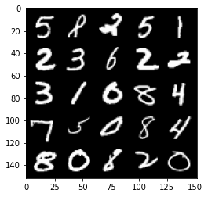


    Step 8100: Generator loss: 82.57325866699219, critic loss: -18.359965005159378


    Step 8150: Generator loss: 88.49420257568359, critic loss: -15.538886476993557


    Step 8200: Generator loss: 92.5031381225586, critic loss: 2.162937791109086


    Step 8250: Generator loss: 91.00879974365235, critic loss: -3.9574946012496937


    Step 8300: Generator loss: 81.383818359375, critic loss: -14.418639464855197


    Step 8350: Generator loss: 84.02410125732422, critic loss: -17.72073389720917


    Step 8400: Generator loss: 85.80985610961915, critic loss: -16.22680687355995


```python

```
