# Build a Conditional GAN

### Goals
In this notebook, you're going to make a conditional GAN in order to generate hand-written images of digits, conditioned on the digit to be generated (the class vector). This will let you choose what digit you want to generate.

You'll then do some exploration of the generated images to visualize what the noise and class vectors mean.  

### Learning Objectives
1.   Learn the technical difference between a conditional and unconditional GAN.
2.   Understand the distinction between the class and noise vector in a conditional GAN.


## Getting Started

For this assignment, you will be using the MNIST dataset again, but there's nothing stopping you from applying this generator code to produce images of animals conditioned on the species or pictures of faces conditioned on facial characteristics.

Note that this assignment requires no changes to the architectures of the generator or discriminator, only changes to the data passed to both. The generator will no longer take `z_dim` as an argument, but  `input_dim` instead, since you need to pass in both the noise and class vectors. In addition to good variable naming, this also means that you can use the generator and discriminator code you have previously written with different parameters.

You will begin by importing the necessary libraries and building the generator and discriminator.

#### Packages and Visualization


```python
import torch
from torch import nn
from tqdm.auto import tqdm
from torchvision import transforms
from torchvision.datasets import MNIST
from torchvision.utils import make_grid
from torch.utils.data import DataLoader
import matplotlib.pyplot as plt
torch.manual_seed(0) # Set for our testing purposes, please do not change!

def show_tensor_images(image_tensor, num_images=25, size=(1, 28, 28), nrow=5, show=True):
    '''
    Function for visualizing images: Given a tensor of images, number of images, and
    size per image, plots and prints the images in an uniform grid.
    '''
    image_tensor = (image_tensor + 1) / 2
    image_unflat = image_tensor.detach().cpu()
    image_grid = make_grid(image_unflat[:num_images], nrow=nrow)
    plt.imshow(image_grid.permute(1, 2, 0).squeeze())
    if show:
        plt.show()
```

#### Generator and Noise


```python
class Generator(nn.Module):
    '''
    Generator Class
    Values:
        input_dim: the dimension of the input vector, a scalar
        im_chan: the number of channels in the images, fitted for the dataset used, a scalar
              (MNIST is black-and-white, so 1 channel is your default)
        hidden_dim: the inner dimension, a scalar
    '''
    def __init__(self, input_dim=10, im_chan=1, hidden_dim=64):
        super(Generator, self).__init__()
        self.input_dim = input_dim
        # Build the neural network
        self.gen = nn.Sequential(
            self.make_gen_block(input_dim, hidden_dim * 4),
            self.make_gen_block(hidden_dim * 4, hidden_dim * 2, kernel_size=4, stride=1),
            self.make_gen_block(hidden_dim * 2, hidden_dim),
            self.make_gen_block(hidden_dim, im_chan, kernel_size=4, final_layer=True),
        )

    def make_gen_block(self, input_channels, output_channels, kernel_size=3, stride=2, final_layer=False):
        '''
        Function to return a sequence of operations corresponding to a generator block of DCGAN;
        a transposed convolution, a batchnorm (except in the final layer), and an activation.
        Parameters:
            input_channels: how many channels the input feature representation has
            output_channels: how many channels the output feature representation should have
            kernel_size: the size of each convolutional filter, equivalent to (kernel_size, kernel_size)
            stride: the stride of the convolution
            final_layer: a boolean, true if it is the final layer and false otherwise 
                      (affects activation and batchnorm)
        '''
        if not final_layer:
            return nn.Sequential(
                nn.ConvTranspose2d(input_channels, output_channels, kernel_size, stride),
                nn.BatchNorm2d(output_channels),
                nn.ReLU(inplace=True),
            )
        else:
            return nn.Sequential(
                nn.ConvTranspose2d(input_channels, output_channels, kernel_size, stride),
                nn.Tanh(),
            )

    def forward(self, noise):
        '''
        Function for completing a forward pass of the generator: Given a noise tensor, 
        returns generated images.
        Parameters:
            noise: a noise tensor with dimensions (n_samples, input_dim)
        '''
        x = noise.view(len(noise), self.input_dim, 1, 1)
        return self.gen(x)

def get_noise(n_samples, input_dim, device='cpu'):
    '''
    Function for creating noise vectors: Given the dimensions (n_samples, input_dim)
    creates a tensor of that shape filled with random numbers from the normal distribution.
    Parameters:
        n_samples: the number of samples to generate, a scalar
        input_dim: the dimension of the input vector, a scalar
        device: the device type
    '''
    return torch.randn(n_samples, input_dim, device=device)
```

#### Discriminator


```python
class Discriminator(nn.Module):
    '''
    Discriminator Class
    Values:
      im_chan: the number of channels in the images, fitted for the dataset used, a scalar
            (MNIST is black-and-white, so 1 channel is your default)
      hidden_dim: the inner dimension, a scalar
    '''
    def __init__(self, im_chan=1, hidden_dim=64):
        super(Discriminator, self).__init__()
        self.disc = nn.Sequential(
            self.make_disc_block(im_chan, hidden_dim),
            self.make_disc_block(hidden_dim, hidden_dim * 2),
            self.make_disc_block(hidden_dim * 2, 1, final_layer=True),
        )

    def make_disc_block(self, input_channels, output_channels, kernel_size=4, stride=2, final_layer=False):
        '''
        Function to return a sequence of operations corresponding to a discriminator block of the DCGAN; 
        a convolution, a batchnorm (except in the final layer), and an activation (except in the final layer).
        Parameters:
            input_channels: how many channels the input feature representation has
            output_channels: how many channels the output feature representation should have
            kernel_size: the size of each convolutional filter, equivalent to (kernel_size, kernel_size)
            stride: the stride of the convolution
            final_layer: a boolean, true if it is the final layer and false otherwise 
                      (affects activation and batchnorm)
        '''
        if not final_layer:
            return nn.Sequential(
                nn.Conv2d(input_channels, output_channels, kernel_size, stride),
                nn.BatchNorm2d(output_channels),
                nn.LeakyReLU(0.2, inplace=True),
            )
        else:
            return nn.Sequential(
                nn.Conv2d(input_channels, output_channels, kernel_size, stride),
            )

    def forward(self, image):
        '''
        Function for completing a forward pass of the discriminator: Given an image tensor, 
        returns a 1-dimension tensor representing fake/real.
        Parameters:
            image: a flattened image tensor with dimension (im_chan)
        '''
        disc_pred = self.disc(image)
        return disc_pred.view(len(disc_pred), -1)
```

## Class Input

In conditional GANs, the input vector for the generator will also need to include the class information. The class is represented using a one-hot encoded vector where its length is the number of classes and each index represents a class. The vector is all 0's and a 1 on the chosen class. Given the labels of multiple images (e.g. from a batch) and number of classes, please create one-hot vectors for each label. There is a class within the PyTorch functional library that can help you.

<details>

<summary>
<font size="3" color="green">
<b>Optional hints for <code><font size="4">get_one_hot_labels</font></code></b>
</font>
</summary>

1.   This code can be done in one line.
2.   The documentation for [F.one_hot](https://pytorch.org/docs/stable/nn.functional.html#torch.nn.functional.one_hot) may be helpful.

</details>


```python
# UNQ_C1 (UNIQUE CELL IDENTIFIER, DO NOT EDIT)
# GRADED FUNCTION: get_one_hot_labels

import torch.nn.functional as F
def get_one_hot_labels(labels, n_classes):
    '''
    Function for creating one-hot vectors for the labels, returns a tensor of shape (?, num_classes).
    Parameters:
        labels: tensor of labels from the dataloader, size (?)
        n_classes: the total number of classes in the dataset, an integer scalar
    '''
    #### START CODE HERE ####
    return F.one_hot(labels,n_classes)
    #### END CODE HERE ####
```


```python
assert (
    get_one_hot_labels(
        labels=torch.Tensor([[0, 2, 1]]).long(),
        n_classes=3
    ).tolist() == 
    [[
      [1, 0, 0], 
      [0, 0, 1], 
      [0, 1, 0]
    ]]
)
print("Success!")
```

    Success!


Next, you need to be able to concatenate the one-hot class vector to the noise vector before giving it to the generator. You will also need to do this when adding the class channels to the discriminator.

To do this, you will need to write a function that combines two vectors. Remember that you need to ensure that the vectors are the same type: floats. Again, you can look to the PyTorch library for help.
<details>
<summary>
<font size="3" color="green">
<b>Optional hints for <code><font size="4">combine_vectors</font></code></b>
</font>
</summary>

1.   This code can also be written in one line.
2.   The documentation for [torch.cat](https://pytorch.org/docs/master/generated/torch.cat.html) may be helpful.
3.   Specifically, you might want to look at what the `dim` argument of `torch.cat` does.

</details>


```python
# UNQ_C2 (UNIQUE CELL IDENTIFIER, DO NOT EDIT)
# GRADED FUNCTION: combine_vectors
def combine_vectors(x, y):
    '''
    Function for combining two vectors with shapes (n_samples, ?) and (n_samples, ?).
    Parameters:
      x: (n_samples, ?) the first vector. 
        In this assignment, this will be the noise vector of shape (n_samples, z_dim), 
        but you shouldn't need to know the second dimension's size.
      y: (n_samples, ?) the second vector.
        Once again, in this assignment this will be the one-hot class vector 
        with the shape (n_samples, n_classes), but you shouldn't assume this in your code.
    '''
    # Note: Make sure this function outputs a float no matter what inputs it receives
    #### START CODE HERE ####
    combined = torch.cat((x.float(),y.float()),1)
    #### END CODE HERE ####
    return combined
```


```python
combined = combine_vectors(torch.tensor([[1, 2], [3, 4]]), torch.tensor([[5, 6], [7, 8]]));
# Check exact order of elements
assert torch.all(combined == torch.tensor([[1, 2, 5, 6], [3, 4, 7, 8]]))
# Tests that items are of float type
assert (type(combined[0][0].item()) == float)
# Check shapes
combined = combine_vectors(torch.randn(1, 4, 5), torch.randn(1, 8, 5));
assert tuple(combined.shape) == (1, 12, 5)
assert tuple(combine_vectors(torch.randn(1, 10, 12).long(), torch.randn(1, 20, 12).long()).shape) == (1, 30, 12)
print("Success!")
```

    Success!


## Training
Now you can start to put it all together!
First, you will define some new parameters:

*   mnist_shape: the number of pixels in each MNIST image, which has dimensions 28 x 28 and one channel (because it's black-and-white) so 1 x 28 x 28
*   n_classes: the number of classes in MNIST (10, since there are the digits from 0 to 9)


```python
mnist_shape = (1, 28, 28)
n_classes = 10
```

And you also include the same parameters from previous assignments:

  *   criterion: the loss function
  *   n_epochs: the number of times you iterate through the entire dataset when training
  *   z_dim: the dimension of the noise vector
  *   display_step: how often to display/visualize the images
  *   batch_size: the number of images per forward/backward pass
  *   lr: the learning rate
  *   device: the device type


```python
criterion = nn.BCEWithLogitsLoss()
n_epochs = 200
z_dim = 64
display_step = 500
batch_size = 128
lr = 0.0002
device = 'cuda'

transform = transforms.Compose([
    transforms.ToTensor(),
    transforms.Normalize((0.5,), (0.5,)),
])

dataloader = DataLoader(
    MNIST('.', download=False, transform=transform),
    batch_size=batch_size,
    shuffle=True)
```

Then, you can initialize your generator, discriminator, and optimizers. To do this, you will need to update the input dimensions for both models. For the generator, you will need to calculate the size of the input vector; recall that for conditional GANs, the generator's input is the noise vector concatenated with the class vector. For the discriminator, you need to add a channel for every class.


```python
# UNQ_C3 (UNIQUE CELL IDENTIFIER, DO NOT EDIT)
# GRADED FUNCTION: get_input_dimensions
def get_input_dimensions(z_dim, mnist_shape, n_classes):
    '''
    Function for getting the size of the conditional input dimensions 
    from z_dim, the image shape, and number of classes.
    Parameters:
        z_dim: the dimension of the noise vector, a scalar
        mnist_shape: the shape of each MNIST image as (C, W, H), which is (1, 28, 28)
        n_classes: the total number of classes in the dataset, an integer scalar
                (10 for MNIST)
    Returns: 
        generator_input_dim: the input dimensionality of the conditional generator, 
                          which takes the noise and class vectors
        discriminator_im_chan: the number of input channels to the discriminator
                            (e.g. C x 28 x 28 for MNIST)
    '''
    #### START CODE HERE ####
    generator_input_dim = z_dim + n_classes
    discriminator_im_chan = mnist_shape[0] + n_classes
    #### END CODE HERE ####
    return generator_input_dim, discriminator_im_chan
```


```python
def test_input_dims():
    gen_dim, disc_dim = get_input_dimensions(23, (12, 23, 52), 9)
    assert gen_dim == 32
    assert disc_dim == 21
test_input_dims()
print("Success!")
```

    Success!


```python
generator_input_dim, discriminator_im_chan = get_input_dimensions(z_dim, mnist_shape, n_classes)

gen = Generator(input_dim=generator_input_dim).to(device)
gen_opt = torch.optim.Adam(gen.parameters(), lr=lr)
disc = Discriminator(im_chan=discriminator_im_chan).to(device)
disc_opt = torch.optim.Adam(disc.parameters(), lr=lr)

def weights_init(m):
    if isinstance(m, nn.Conv2d) or isinstance(m, nn.ConvTranspose2d):
        torch.nn.init.normal_(m.weight, 0.0, 0.02)
    if isinstance(m, nn.BatchNorm2d):
        torch.nn.init.normal_(m.weight, 0.0, 0.02)
        torch.nn.init.constant_(m.bias, 0)
gen = gen.apply(weights_init)
disc = disc.apply(weights_init)
```

Now to train, you would like both your generator and your discriminator to know what class of image should be generated. There are a few locations where you will need to implement code.

For example, if you're generating a picture of the number "1", you would need to:
  
1.   Tell that to the generator, so that it knows it should be generating a "1"
2.   Tell that to the discriminator, so that it knows it should be looking at a "1". If the discriminator is told it should be looking at a 1 but sees something that's clearly an 8, it can guess that it's probably fake

There are no explicit unit tests here -- if this block of code runs and you don't change any of the other variables, then you've done it correctly!


```python
# UNQ_C4 (UNIQUE CELL IDENTIFIER, DO NOT EDIT)
# GRADED CELL
cur_step = 0
generator_losses = []
discriminator_losses = []

#UNIT TEST NOTE: Initializations needed for grading
noise_and_labels = False
fake = False

fake_image_and_labels = False
real_image_and_labels = False
disc_fake_pred = False
disc_real_pred = False

for epoch in range(n_epochs):
    # Dataloader returns the batches and the labels
    for real, labels in tqdm(dataloader):
        cur_batch_size = len(real)
        # Flatten the batch of real images from the dataset
        real = real.to(device)

        one_hot_labels = get_one_hot_labels(labels.to(device), n_classes)
        image_one_hot_labels = one_hot_labels[:, :, None, None]
        image_one_hot_labels = image_one_hot_labels.repeat(1, 1, mnist_shape[1], mnist_shape[2])

        ### Update discriminator ###
        # Zero out the discriminator gradients
        disc_opt.zero_grad()
        # Get noise corresponding to the current batch_size 
        fake_noise = get_noise(cur_batch_size, z_dim, device=device)
        
        # Now you can get the images from the generator
        # Steps: 1) Combine the noise vectors and the one-hot labels for the generator
        #        2) Generate the conditioned fake images
       
        #### START CODE HERE ####
        noise_and_labels = combine_vectors(fake_noise, one_hot_labels)
        fake = gen(noise_and_labels)
        #### END CODE HERE ####
        
        # Make sure that enough images were generated
        assert len(fake) == len(real)
        # Check that correct tensors were combined
        assert tuple(noise_and_labels.shape) == (cur_batch_size, fake_noise.shape[1] + one_hot_labels.shape[1])
        # It comes from the correct generator
        assert tuple(fake.shape) == (len(real), 1, 28, 28)

        # Now you can get the predictions from the discriminator
        # Steps: 1) Create the input for the discriminator
        #           a) Combine the fake images with image_one_hot_labels, 
        #              remember to detach the generator (.detach()) so you do not backpropagate through it
        #           b) Combine the real images with image_one_hot_labels
        #        2) Get the discriminator's prediction on the fakes as disc_fake_pred
        #        3) Get the discriminator's prediction on the reals as disc_real_pred
        
        #### START CODE HERE ####
        fake_image_and_labels = combine_vectors(fake, image_one_hot_labels)
        real_image_and_labels = combine_vectors(real, image_one_hot_labels)
        disc_fake_pred = disc(fake_image_and_labels.detach())
        disc_real_pred = disc(real_image_and_labels)
        #### END CODE HERE ####
        
        # Make sure shapes are correct 
        assert tuple(fake_image_and_labels.shape) == (len(real), fake.detach().shape[1] + image_one_hot_labels.shape[1], 28 ,28)
        assert tuple(real_image_and_labels.shape) == (len(real), real.shape[1] + image_one_hot_labels.shape[1], 28 ,28)
        # Make sure that enough predictions were made
        assert len(disc_real_pred) == len(real)
        # Make sure that the inputs are different
        assert torch.any(fake_image_and_labels != real_image_and_labels)
        # Shapes must match
        assert tuple(fake_image_and_labels.shape) == tuple(real_image_and_labels.shape)
        assert tuple(disc_fake_pred.shape) == tuple(disc_real_pred.shape)
        
        
        disc_fake_loss = criterion(disc_fake_pred, torch.zeros_like(disc_fake_pred))
        disc_real_loss = criterion(disc_real_pred, torch.ones_like(disc_real_pred))
        disc_loss = (disc_fake_loss + disc_real_loss) / 2
        disc_loss.backward(retain_graph=True)
        disc_opt.step() 

        # Keep track of the average discriminator loss
        discriminator_losses += [disc_loss.item()]

        ### Update generator ###
        # Zero out the generator gradients
        gen_opt.zero_grad()

        fake_image_and_labels = combine_vectors(fake, image_one_hot_labels)
        # This will error if you didn't concatenate your labels to your image correctly
        disc_fake_pred = disc(fake_image_and_labels)
        gen_loss = criterion(disc_fake_pred, torch.ones_like(disc_fake_pred))
        gen_loss.backward()
        gen_opt.step()

        # Keep track of the generator losses
        generator_losses += [gen_loss.item()]
        #

        if cur_step % display_step == 0 and cur_step > 0:
            gen_mean = sum(generator_losses[-display_step:]) / display_step
            disc_mean = sum(discriminator_losses[-display_step:]) / display_step
            print(f"Step {cur_step}: Generator loss: {gen_mean}, discriminator loss: {disc_mean}")
            show_tensor_images(fake)
            show_tensor_images(real)
            step_bins = 20
            x_axis = sorted([i * step_bins for i in range(len(generator_losses) // step_bins)] * step_bins)
            num_examples = (len(generator_losses) // step_bins) * step_bins
            plt.plot(
                range(num_examples // step_bins), 
                torch.Tensor(generator_losses[:num_examples]).view(-1, step_bins).mean(1),
                label="Generator Loss"
            )
            plt.plot(
                range(num_examples // step_bins), 
                torch.Tensor(discriminator_losses[:num_examples]).view(-1, step_bins).mean(1),
                label="Discriminator Loss"
            )
            plt.legend()
            plt.show()
        elif cur_step == 0:
            print("Congratulations! If you've gotten here, it's working. Please let this train until you're happy with how the generated numbers look, and then go on to the exploration!")
        cur_step += 1
```


    HBox(children=(FloatProgress(value=0.0, max=469.0), HTML(value='')))


    Congratulations! If you've gotten here, it's working. Please let this train until you're happy with how the generated numbers look, and then go on to the exploration!
    


    HBox(children=(FloatProgress(value=0.0, max=469.0), HTML(value='')))


    Step 500: Generator loss: 1.8679991228580475, discriminator loss: 0.3267104803323746


    


    HBox(children=(FloatProgress(value=0.0, max=469.0), HTML(value='')))


    Step 1000: Generator loss: 3.789384890079498, discriminator loss: 0.10210700245574117


    


    HBox(children=(FloatProgress(value=0.0, max=469.0), HTML(value='')))


    Step 1500: Generator loss: 3.7442474155426027, discriminator loss: 0.09374465413764119


    


    HBox(children=(FloatProgress(value=0.0, max=469.0), HTML(value='')))


    Step 2000: Generator loss: 3.575559863090515, discriminator loss: 0.10441552789881825


    


    HBox(children=(FloatProgress(value=0.0, max=469.0), HTML(value='')))


    Step 2500: Generator loss: 2.907542094230652, discriminator loss: 0.21228134620934724


    


    HBox(children=(FloatProgress(value=0.0, max=469.0), HTML(value='')))


    Step 3000: Generator loss: 2.362451486349106, discriminator loss: 0.2914656239449978


    


    HBox(children=(FloatProgress(value=0.0, max=469.0), HTML(value='')))


    Step 3500: Generator loss: 2.211599237680435, discriminator loss: 0.3378487057685852


    


    HBox(children=(FloatProgress(value=0.0, max=469.0), HTML(value='')))


    Step 4000: Generator loss: 2.0458523819446564, discriminator loss: 0.346180747628212


    


    HBox(children=(FloatProgress(value=0.0, max=469.0), HTML(value='')))


    Step 4500: Generator loss: 1.8216176213026047, discriminator loss: 0.36343536508083346


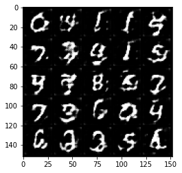


    


    HBox(children=(FloatProgress(value=0.0, max=469.0), HTML(value='')))


    Step 5000: Generator loss: 1.7177851731777192, discriminator loss: 0.4129976559877396


    


    HBox(children=(FloatProgress(value=0.0, max=469.0), HTML(value='')))


    Step 5500: Generator loss: 1.6070408207178115, discriminator loss: 0.42446583980321884


    


    HBox(children=(FloatProgress(value=0.0, max=469.0), HTML(value='')))


    Step 6000: Generator loss: 1.5414209159612655, discriminator loss: 0.42733276581764224


    


    HBox(children=(FloatProgress(value=0.0, max=469.0), HTML(value='')))


    Step 6500: Generator loss: 1.481920649290085, discriminator loss: 0.45214588576555254


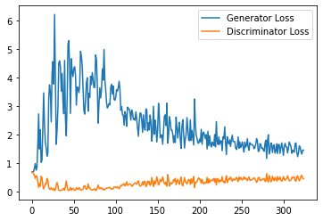


    


    HBox(children=(FloatProgress(value=0.0, max=469.0), HTML(value='')))


    Step 7000: Generator loss: 1.4355710998773574, discriminator loss: 0.4872546342611313


    


    HBox(children=(FloatProgress(value=0.0, max=469.0), HTML(value='')))


    Step 7500: Generator loss: 1.3529329024553298, discriminator loss: 0.5061288794875145


    


    HBox(children=(FloatProgress(value=0.0, max=469.0), HTML(value='')))


    


    HBox(children=(FloatProgress(value=0.0, max=469.0), HTML(value='')))


    Step 8000: Generator loss: 1.24739057970047, discriminator loss: 0.5349262036085128


    


    HBox(children=(FloatProgress(value=0.0, max=469.0), HTML(value='')))


    Step 8500: Generator loss: 1.1985747965574265, discriminator loss: 0.548648167192936


    


    HBox(children=(FloatProgress(value=0.0, max=469.0), HTML(value='')))


    Step 9000: Generator loss: 1.1909606240987778, discriminator loss: 0.5550902925729752


    


    HBox(children=(FloatProgress(value=0.0, max=469.0), HTML(value='')))


    Step 9500: Generator loss: 1.1347003533840179, discriminator loss: 0.5642540452480316


    


    HBox(children=(FloatProgress(value=0.0, max=469.0), HTML(value='')))


    Step 10000: Generator loss: 1.0754632521867753, discriminator loss: 0.5815574128031731


    


    HBox(children=(FloatProgress(value=0.0, max=469.0), HTML(value='')))


    Step 10500: Generator loss: 1.1256733713150024, discriminator loss: 0.5934650522470474


    


    HBox(children=(FloatProgress(value=0.0, max=469.0), HTML(value='')))


    Step 11000: Generator loss: 1.098159499645233, discriminator loss: 0.5752755016684532


    


    HBox(children=(FloatProgress(value=0.0, max=469.0), HTML(value='')))


    Step 11500: Generator loss: 1.0613529154062271, discriminator loss: 0.5845157452821732


    


    HBox(children=(FloatProgress(value=0.0, max=469.0), HTML(value='')))


    Step 12000: Generator loss: 1.1003808945417404, discriminator loss: 0.5947155783772469


    


    HBox(children=(FloatProgress(value=0.0, max=469.0), HTML(value='')))


    Step 12500: Generator loss: 1.0717255862951278, discriminator loss: 0.5917614689469337


    


    HBox(children=(FloatProgress(value=0.0, max=469.0), HTML(value='')))


    Step 13000: Generator loss: 1.0673319256305696, discriminator loss: 0.5914480391740798


    


    HBox(children=(FloatProgress(value=0.0, max=469.0), HTML(value='')))


    Step 13500: Generator loss: 0.9661303280591965, discriminator loss: 0.5991635414361953


    


    HBox(children=(FloatProgress(value=0.0, max=469.0), HTML(value='')))


    Step 14000: Generator loss: 1.010442683339119, discriminator loss: 0.6078032803535461


    


    HBox(children=(FloatProgress(value=0.0, max=469.0), HTML(value='')))


    Step 14500: Generator loss: 1.0141332755088805, discriminator loss: 0.6040048477649689


    


    HBox(children=(FloatProgress(value=0.0, max=469.0), HTML(value='')))


    Step 15000: Generator loss: 1.00544608938694, discriminator loss: 0.6054547709822655


    


    HBox(children=(FloatProgress(value=0.0, max=469.0), HTML(value='')))


    


    HBox(children=(FloatProgress(value=0.0, max=469.0), HTML(value='')))


    Step 15500: Generator loss: 0.9976837000846863, discriminator loss: 0.6094673414230347


    


    HBox(children=(FloatProgress(value=0.0, max=469.0), HTML(value='')))


    Step 16000: Generator loss: 0.9573144071102142, discriminator loss: 0.6115869669318199


    


    HBox(children=(FloatProgress(value=0.0, max=469.0), HTML(value='')))


    Step 16500: Generator loss: 0.9649377470016479, discriminator loss: 0.612546572804451


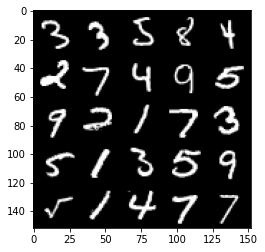


    


    HBox(children=(FloatProgress(value=0.0, max=469.0), HTML(value='')))


    Step 17000: Generator loss: 0.9584605327248573, discriminator loss: 0.6161971957683563


    


    HBox(children=(FloatProgress(value=0.0, max=469.0), HTML(value='')))


    Step 17500: Generator loss: 0.9544539400339127, discriminator loss: 0.6071312499046325


    


    HBox(children=(FloatProgress(value=0.0, max=469.0), HTML(value='')))


    Step 18000: Generator loss: 0.9562494164705276, discriminator loss: 0.6170732910633088


    


    HBox(children=(FloatProgress(value=0.0, max=469.0), HTML(value='')))


    Step 18500: Generator loss: 0.96331755900383, discriminator loss: 0.6112976044416427


    


    HBox(children=(FloatProgress(value=0.0, max=469.0), HTML(value='')))


    Step 19000: Generator loss: 0.9571741995811462, discriminator loss: 0.6173712481856346


    


    HBox(children=(FloatProgress(value=0.0, max=469.0), HTML(value='')))


    Step 19500: Generator loss: 0.9620773801803589, discriminator loss: 0.6137687757015228


    


    HBox(children=(FloatProgress(value=0.0, max=469.0), HTML(value='')))


    Step 20000: Generator loss: 0.9510729919672012, discriminator loss: 0.622190198123455


    


    HBox(children=(FloatProgress(value=0.0, max=469.0), HTML(value='')))


    Step 20500: Generator loss: 0.9528296921253204, discriminator loss: 0.6160503843426705


    


    HBox(children=(FloatProgress(value=0.0, max=469.0), HTML(value='')))


    Step 21000: Generator loss: 0.952029859662056, discriminator loss: 0.6190810635089874


    


    HBox(children=(FloatProgress(value=0.0, max=469.0), HTML(value='')))


    Step 21500: Generator loss: 0.9208219341039657, discriminator loss: 0.6154331807494163


    


    HBox(children=(FloatProgress(value=0.0, max=469.0), HTML(value='')))


    Step 22000: Generator loss: 0.9611254876852036, discriminator loss: 0.616727275133133


    


    HBox(children=(FloatProgress(value=0.0, max=469.0), HTML(value='')))


    Step 22500: Generator loss: 0.9255991640090943, discriminator loss: 0.6281564878225326


    


    HBox(children=(FloatProgress(value=0.0, max=469.0), HTML(value='')))


    


    HBox(children=(FloatProgress(value=0.0, max=469.0), HTML(value='')))


    Step 23000: Generator loss: 0.9234839727878571, discriminator loss: 0.6211764288544654


    


    HBox(children=(FloatProgress(value=0.0, max=469.0), HTML(value='')))


    Step 23500: Generator loss: 0.9135037307739258, discriminator loss: 0.6279406474232674


    


    HBox(children=(FloatProgress(value=0.0, max=469.0), HTML(value='')))


    Step 24000: Generator loss: 0.9169499262571335, discriminator loss: 0.6261396425366401


    


    HBox(children=(FloatProgress(value=0.0, max=469.0), HTML(value='')))


    Step 24500: Generator loss: 0.9008434221744538, discriminator loss: 0.6263414969444275


    


    HBox(children=(FloatProgress(value=0.0, max=469.0), HTML(value='')))


    Step 25000: Generator loss: 0.9176499098539352, discriminator loss: 0.6293881508111954


    


    HBox(children=(FloatProgress(value=0.0, max=469.0), HTML(value='')))


    Step 25500: Generator loss: 0.903706824183464, discriminator loss: 0.6273158496022224


    


    HBox(children=(FloatProgress(value=0.0, max=469.0), HTML(value='')))


    Step 26000: Generator loss: 0.9002434653043747, discriminator loss: 0.6365967673063279


    


    HBox(children=(FloatProgress(value=0.0, max=469.0), HTML(value='')))


    Step 26500: Generator loss: 0.8946927429437638, discriminator loss: 0.6347081625461578


    


    HBox(children=(FloatProgress(value=0.0, max=469.0), HTML(value='')))


    Step 27000: Generator loss: 0.8832943286895752, discriminator loss: 0.6290186914205551


    


    HBox(children=(FloatProgress(value=0.0, max=469.0), HTML(value='')))


    Step 27500: Generator loss: 0.8871747826337815, discriminator loss: 0.6328295313119888


    


    HBox(children=(FloatProgress(value=0.0, max=469.0), HTML(value='')))


    Step 28000: Generator loss: 0.8880547478199005, discriminator loss: 0.6348772343993186


    


    HBox(children=(FloatProgress(value=0.0, max=469.0), HTML(value='')))


    Step 28500: Generator loss: 0.9068362658023834, discriminator loss: 0.6324690051674843


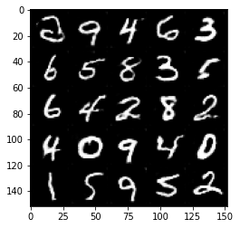


    


    HBox(children=(FloatProgress(value=0.0, max=469.0), HTML(value='')))


    Step 29000: Generator loss: 0.8854779169559479, discriminator loss: 0.6368885542154312


    


    HBox(children=(FloatProgress(value=0.0, max=469.0), HTML(value='')))


    Step 29500: Generator loss: 0.879701446890831, discriminator loss: 0.6365156829357147


    


    HBox(children=(FloatProgress(value=0.0, max=469.0), HTML(value='')))


    Step 30000: Generator loss: 0.8843917804956436, discriminator loss: 0.6370160833597184


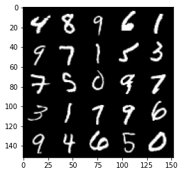


    


    HBox(children=(FloatProgress(value=0.0, max=469.0), HTML(value='')))


    


    HBox(children=(FloatProgress(value=0.0, max=469.0), HTML(value='')))


    Step 30500: Generator loss: 0.8800982199907302, discriminator loss: 0.63960025370121


    


    HBox(children=(FloatProgress(value=0.0, max=469.0), HTML(value='')))


    Step 31000: Generator loss: 0.8946930216550827, discriminator loss: 0.6322803736925126


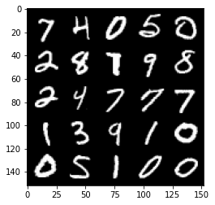


    


    HBox(children=(FloatProgress(value=0.0, max=469.0), HTML(value='')))


    Step 31500: Generator loss: 0.8977644770145417, discriminator loss: 0.6371476237177849


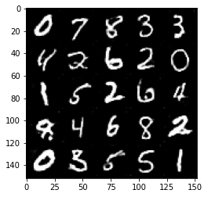


    


    HBox(children=(FloatProgress(value=0.0, max=469.0), HTML(value='')))


    Step 32000: Generator loss: 0.8879396759271622, discriminator loss: 0.6373700023889541


    


    HBox(children=(FloatProgress(value=0.0, max=469.0), HTML(value='')))


    Step 32500: Generator loss: 0.8849141023159027, discriminator loss: 0.6325517443418502


    


    HBox(children=(FloatProgress(value=0.0, max=469.0), HTML(value='')))


    Step 33000: Generator loss: 0.8929408574104309, discriminator loss: 0.636130875647068


    


    HBox(children=(FloatProgress(value=0.0, max=469.0), HTML(value='')))


    Step 33500: Generator loss: 0.8757601608037948, discriminator loss: 0.6380148663520813


    


    HBox(children=(FloatProgress(value=0.0, max=469.0), HTML(value='')))


    Step 34000: Generator loss: 0.8858012056350708, discriminator loss: 0.6334453995227813


    


    HBox(children=(FloatProgress(value=0.0, max=469.0), HTML(value='')))


    Step 34500: Generator loss: 0.8696090486049652, discriminator loss: 0.6374025465250015


    


    HBox(children=(FloatProgress(value=0.0, max=469.0), HTML(value='')))


    Step 35000: Generator loss: 0.8643718534708023, discriminator loss: 0.6393452188968658


    


    HBox(children=(FloatProgress(value=0.0, max=469.0), HTML(value='')))


    Step 35500: Generator loss: 0.8653386870622635, discriminator loss: 0.6361521000862121


    


    HBox(children=(FloatProgress(value=0.0, max=469.0), HTML(value='')))


    Step 36000: Generator loss: 0.8788600717782974, discriminator loss: 0.6335916843414306


    


    HBox(children=(FloatProgress(value=0.0, max=469.0), HTML(value='')))


    Step 36500: Generator loss: 0.8914902054071426, discriminator loss: 0.638466118812561


    


    HBox(children=(FloatProgress(value=0.0, max=469.0), HTML(value='')))


    Step 37000: Generator loss: 0.8936330989599228, discriminator loss: 0.6328526782393455


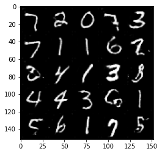


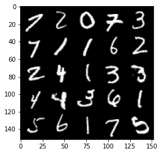


    


    HBox(children=(FloatProgress(value=0.0, max=469.0), HTML(value='')))


    Step 37500: Generator loss: 0.8708931595087052, discriminator loss: 0.6327626342773438


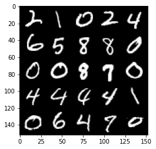


    


    HBox(children=(FloatProgress(value=0.0, max=469.0), HTML(value='')))


    


    HBox(children=(FloatProgress(value=0.0, max=469.0), HTML(value='')))


    Step 38000: Generator loss: 0.8676738671064377, discriminator loss: 0.6355912523269653


    


    HBox(children=(FloatProgress(value=0.0, max=469.0), HTML(value='')))


    Step 38500: Generator loss: 0.8821002460718155, discriminator loss: 0.6319642045497894


    


    HBox(children=(FloatProgress(value=0.0, max=469.0), HTML(value='')))


    Step 39000: Generator loss: 0.8892159717082977, discriminator loss: 0.6340846464633941


    


    HBox(children=(FloatProgress(value=0.0, max=469.0), HTML(value='')))


    Step 39500: Generator loss: 0.8824746520519257, discriminator loss: 0.6321679291725159


    


    HBox(children=(FloatProgress(value=0.0, max=469.0), HTML(value='')))


    Step 40000: Generator loss: 0.9005439398288727, discriminator loss: 0.6327326024770736


    


    HBox(children=(FloatProgress(value=0.0, max=469.0), HTML(value='')))


    Step 40500: Generator loss: 0.8900754263401032, discriminator loss: 0.6330672000646591


    


    HBox(children=(FloatProgress(value=0.0, max=469.0), HTML(value='')))


    Step 41000: Generator loss: 0.8922224735021591, discriminator loss: 0.6364290853738784


    


    HBox(children=(FloatProgress(value=0.0, max=469.0), HTML(value='')))


    Step 41500: Generator loss: 0.8974537723064423, discriminator loss: 0.6304697743654251


    


    HBox(children=(FloatProgress(value=0.0, max=469.0), HTML(value='')))


    Step 42000: Generator loss: 0.9000690361261368, discriminator loss: 0.6287537775039673


    


    HBox(children=(FloatProgress(value=0.0, max=469.0), HTML(value='')))


    Step 42500: Generator loss: 0.8790611732006073, discriminator loss: 0.6329949952363968


    


    HBox(children=(FloatProgress(value=0.0, max=469.0), HTML(value='')))


    Step 43000: Generator loss: 0.88353393805027, discriminator loss: 0.6298955345153808


    


    HBox(children=(FloatProgress(value=0.0, max=469.0), HTML(value='')))


    Step 43500: Generator loss: 0.8865647789239883, discriminator loss: 0.6277472196817399


    


    HBox(children=(FloatProgress(value=0.0, max=469.0), HTML(value='')))


    Step 44000: Generator loss: 0.8881422020196915, discriminator loss: 0.6326629419922829


    


    HBox(children=(FloatProgress(value=0.0, max=469.0), HTML(value='')))


    Step 44500: Generator loss: 0.867263106226921, discriminator loss: 0.6316789592504501


    


    HBox(children=(FloatProgress(value=0.0, max=469.0), HTML(value='')))


    Step 45000: Generator loss: 0.896694842338562, discriminator loss: 0.6320805286765099


    


    HBox(children=(FloatProgress(value=0.0, max=469.0), HTML(value='')))


    


    HBox(children=(FloatProgress(value=0.0, max=469.0), HTML(value='')))


    Step 45500: Generator loss: 0.8988703831434249, discriminator loss: 0.6284577487111092


    


    HBox(children=(FloatProgress(value=0.0, max=469.0), HTML(value='')))


    Step 46000: Generator loss: 0.9038562163114547, discriminator loss: 0.628188318490982


    


    HBox(children=(FloatProgress(value=0.0, max=469.0), HTML(value='')))


    Step 46500: Generator loss: 0.8851403053998947, discriminator loss: 0.629873748421669


    


    HBox(children=(FloatProgress(value=0.0, max=469.0), HTML(value='')))


    Step 47000: Generator loss: 0.8918659671545028, discriminator loss: 0.6276552893519401


    


    HBox(children=(FloatProgress(value=0.0, max=469.0), HTML(value='')))


    Step 47500: Generator loss: 0.8948905489444733, discriminator loss: 0.6273259252905846


    


    HBox(children=(FloatProgress(value=0.0, max=469.0), HTML(value='')))


    Step 48000: Generator loss: 0.8857511703968048, discriminator loss: 0.62763774061203


    


    HBox(children=(FloatProgress(value=0.0, max=469.0), HTML(value='')))


    Step 48500: Generator loss: 0.8947601466178894, discriminator loss: 0.6258092093467712


    


    HBox(children=(FloatProgress(value=0.0, max=469.0), HTML(value='')))


    Step 49000: Generator loss: 0.8997336449623108, discriminator loss: 0.6252227855324746


    


    HBox(children=(FloatProgress(value=0.0, max=469.0), HTML(value='')))


    Step 49500: Generator loss: 0.8881633884906769, discriminator loss: 0.6278108807802201


    


    HBox(children=(FloatProgress(value=0.0, max=469.0), HTML(value='')))


    Step 50000: Generator loss: 0.9031751333475113, discriminator loss: 0.6235833206176757


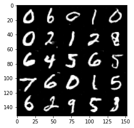


    


    HBox(children=(FloatProgress(value=0.0, max=469.0), HTML(value='')))


    Step 50500: Generator loss: 0.9028211821317673, discriminator loss: 0.6228508814573288


    


    HBox(children=(FloatProgress(value=0.0, max=469.0), HTML(value='')))


    Step 51000: Generator loss: 0.9028174442052841, discriminator loss: 0.6241941150426865


    


    HBox(children=(FloatProgress(value=0.0, max=469.0), HTML(value='')))


    Step 51500: Generator loss: 0.9254976633787155, discriminator loss: 0.6185382200479508


    


    HBox(children=(FloatProgress(value=0.0, max=469.0), HTML(value='')))


    Step 52000: Generator loss: 0.9122002023458481, discriminator loss: 0.6241201653480529


    


    HBox(children=(FloatProgress(value=0.0, max=469.0), HTML(value='')))


    Step 52500: Generator loss: 0.9016115791797638, discriminator loss: 0.6232816277742386


    


    HBox(children=(FloatProgress(value=0.0, max=469.0), HTML(value='')))


    


    HBox(children=(FloatProgress(value=0.0, max=469.0), HTML(value='')))


    Step 53000: Generator loss: 0.9173719358444213, discriminator loss: 0.6225880597829818


    


    HBox(children=(FloatProgress(value=0.0, max=469.0), HTML(value='')))


    Step 53500: Generator loss: 0.933512587428093, discriminator loss: 0.6208648678064347


    


    HBox(children=(FloatProgress(value=0.0, max=469.0), HTML(value='')))


    Step 54000: Generator loss: 0.9233469567298889, discriminator loss: 0.6245452145338058


    


    HBox(children=(FloatProgress(value=0.0, max=469.0), HTML(value='')))


    Step 54500: Generator loss: 0.8991384093761444, discriminator loss: 0.6192299971580505


    


    HBox(children=(FloatProgress(value=0.0, max=469.0), HTML(value='')))


    Step 55000: Generator loss: 0.916352788567543, discriminator loss: 0.6168330903649331


    


    HBox(children=(FloatProgress(value=0.0, max=469.0), HTML(value='')))


    Step 55500: Generator loss: 0.9114199448823929, discriminator loss: 0.6190246252417564


    


    HBox(children=(FloatProgress(value=0.0, max=469.0), HTML(value='')))


    Step 56000: Generator loss: 0.9196728582382202, discriminator loss: 0.6147693569660186


    


    HBox(children=(FloatProgress(value=0.0, max=469.0), HTML(value='')))


    Step 56500: Generator loss: 0.9226906998157501, discriminator loss: 0.6155304791927337


    


    HBox(children=(FloatProgress(value=0.0, max=469.0), HTML(value='')))


    Step 57000: Generator loss: 0.9148487377166749, discriminator loss: 0.6171577944755554


    


    HBox(children=(FloatProgress(value=0.0, max=469.0), HTML(value='')))


    Step 57500: Generator loss: 0.9170636094808579, discriminator loss: 0.613491645514965


    


    HBox(children=(FloatProgress(value=0.0, max=469.0), HTML(value='')))


    Step 58000: Generator loss: 0.9294027409553528, discriminator loss: 0.6122321429252624


    


    HBox(children=(FloatProgress(value=0.0, max=469.0), HTML(value='')))


    Step 58500: Generator loss: 0.9324747142791748, discriminator loss: 0.6126901143789292


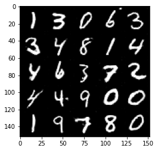


    


    HBox(children=(FloatProgress(value=0.0, max=469.0), HTML(value='')))


    Step 59000: Generator loss: 0.9476124358177185, discriminator loss: 0.6139719088077545


    


    HBox(children=(FloatProgress(value=0.0, max=469.0), HTML(value='')))


    Step 59500: Generator loss: 0.9388933919668198, discriminator loss: 0.6110351285934448


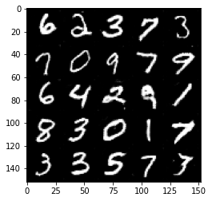


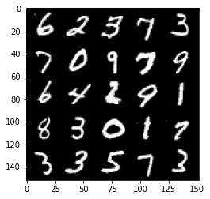


    


    HBox(children=(FloatProgress(value=0.0, max=469.0), HTML(value='')))


    Step 60000: Generator loss: 0.9346889644861222, discriminator loss: 0.610410749733448


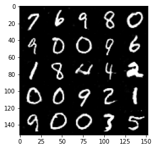


    


    HBox(children=(FloatProgress(value=0.0, max=469.0), HTML(value='')))


    Step 60500: Generator loss: 0.9294041749238968, discriminator loss: 0.6144235017895698


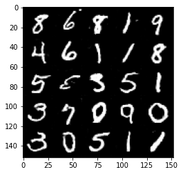


    


    HBox(children=(FloatProgress(value=0.0, max=469.0), HTML(value='')))


    


    HBox(children=(FloatProgress(value=0.0, max=469.0), HTML(value='')))


    Step 61000: Generator loss: 0.9524665993452072, discriminator loss: 0.604184336900711


    


    HBox(children=(FloatProgress(value=0.0, max=469.0), HTML(value='')))


    Step 61500: Generator loss: 0.9389516279697419, discriminator loss: 0.6092228308320046


    


    HBox(children=(FloatProgress(value=0.0, max=469.0), HTML(value='')))


    Step 62000: Generator loss: 0.9427532007694245, discriminator loss: 0.6071121404767037


    


    HBox(children=(FloatProgress(value=0.0, max=469.0), HTML(value='')))


    Step 62500: Generator loss: 0.966851681470871, discriminator loss: 0.6064623129367829


    


    HBox(children=(FloatProgress(value=0.0, max=469.0), HTML(value='')))


    Step 63000: Generator loss: 0.9513238326311112, discriminator loss: 0.6055968971848488


    


    HBox(children=(FloatProgress(value=0.0, max=469.0), HTML(value='')))


    Step 63500: Generator loss: 0.9492398809194564, discriminator loss: 0.6058225127458572


    


    HBox(children=(FloatProgress(value=0.0, max=469.0), HTML(value='')))


    Step 64000: Generator loss: 0.9556446437835693, discriminator loss: 0.602710063636303


    


    HBox(children=(FloatProgress(value=0.0, max=469.0), HTML(value='')))


    Step 64500: Generator loss: 0.9576597626209259, discriminator loss: 0.6032799215316772


    


    HBox(children=(FloatProgress(value=0.0, max=469.0), HTML(value='')))


    Step 65000: Generator loss: 0.9619453415870667, discriminator loss: 0.5977533503174782


    


    HBox(children=(FloatProgress(value=0.0, max=469.0), HTML(value='')))


    Step 65500: Generator loss: 0.9453101065158844, discriminator loss: 0.6029239588975907


    


    HBox(children=(FloatProgress(value=0.0, max=469.0), HTML(value='')))


    Step 66000: Generator loss: 0.9632462419271469, discriminator loss: 0.5976810547709465


    


    HBox(children=(FloatProgress(value=0.0, max=469.0), HTML(value='')))


    Step 66500: Generator loss: 0.9647679253816605, discriminator loss: 0.600209248661995


    


    HBox(children=(FloatProgress(value=0.0, max=469.0), HTML(value='')))


    Step 67000: Generator loss: 0.9771028916835784, discriminator loss: 0.5944171754717826


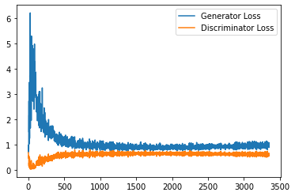


    


    HBox(children=(FloatProgress(value=0.0, max=469.0), HTML(value='')))


    Step 67500: Generator loss: 0.9772269983291626, discriminator loss: 0.5968019403815269


    


    HBox(children=(FloatProgress(value=0.0, max=469.0), HTML(value='')))


    Step 68000: Generator loss: 0.9664703799486161, discriminator loss: 0.6008802940845489


    


    HBox(children=(FloatProgress(value=0.0, max=469.0), HTML(value='')))


    


    HBox(children=(FloatProgress(value=0.0, max=469.0), HTML(value='')))


    Step 68500: Generator loss: 0.9758349281549453, discriminator loss: 0.5940034883618355


    


    HBox(children=(FloatProgress(value=0.0, max=469.0), HTML(value='')))


    Step 69000: Generator loss: 0.9812510389089585, discriminator loss: 0.593992872595787


    


    HBox(children=(FloatProgress(value=0.0, max=469.0), HTML(value='')))


    Step 69500: Generator loss: 0.9765571889877319, discriminator loss: 0.598418084859848


    


    HBox(children=(FloatProgress(value=0.0, max=469.0), HTML(value='')))


    Step 70000: Generator loss: 0.9856766986846924, discriminator loss: 0.59452686971426


    


    HBox(children=(FloatProgress(value=0.0, max=469.0), HTML(value='')))


    Step 70500: Generator loss: 0.9748822177648544, discriminator loss: 0.5948429118990898


    


    HBox(children=(FloatProgress(value=0.0, max=469.0), HTML(value='')))


    Step 71000: Generator loss: 0.9776685147285461, discriminator loss: 0.5959139360189438


    


    HBox(children=(FloatProgress(value=0.0, max=469.0), HTML(value='')))


    Step 71500: Generator loss: 0.9763616577386857, discriminator loss: 0.5880120239257812


    


    HBox(children=(FloatProgress(value=0.0, max=469.0), HTML(value='')))


    Step 72000: Generator loss: 0.9860078635215759, discriminator loss: 0.5940052495598793


    


    HBox(children=(FloatProgress(value=0.0, max=469.0), HTML(value='')))


    Step 72500: Generator loss: 0.978738762140274, discriminator loss: 0.5980985124111176


    


    HBox(children=(FloatProgress(value=0.0, max=469.0), HTML(value='')))


    Step 73000: Generator loss: 0.9939912240505219, discriminator loss: 0.5891323582530021


    


    HBox(children=(FloatProgress(value=0.0, max=469.0), HTML(value='')))


    Step 73500: Generator loss: 0.9845156288146972, discriminator loss: 0.5919685966968536


    


    HBox(children=(FloatProgress(value=0.0, max=469.0), HTML(value='')))


    Step 74000: Generator loss: 0.9838619358539581, discriminator loss: 0.592374684870243


    


    HBox(children=(FloatProgress(value=0.0, max=469.0), HTML(value='')))


    Step 74500: Generator loss: 0.9916516499519348, discriminator loss: 0.5862405723333359


    


    HBox(children=(FloatProgress(value=0.0, max=469.0), HTML(value='')))


    Step 75000: Generator loss: 0.9887028050422668, discriminator loss: 0.5884973168969154


    


    HBox(children=(FloatProgress(value=0.0, max=469.0), HTML(value='')))


    Step 75500: Generator loss: 0.9899302532672882, discriminator loss: 0.5853193885087967


    


    HBox(children=(FloatProgress(value=0.0, max=469.0), HTML(value='')))


    


    HBox(children=(FloatProgress(value=0.0, max=469.0), HTML(value='')))


    Step 76000: Generator loss: 0.9956541445255279, discriminator loss: 0.586280613064766


    


    HBox(children=(FloatProgress(value=0.0, max=469.0), HTML(value='')))


    Step 76500: Generator loss: 1.0046382328271866, discriminator loss: 0.5894216768741608


    


    HBox(children=(FloatProgress(value=0.0, max=469.0), HTML(value='')))


    Step 77000: Generator loss: 1.0077724006175994, discriminator loss: 0.5831878126263619


    


    HBox(children=(FloatProgress(value=0.0, max=469.0), HTML(value='')))


    Step 77500: Generator loss: 0.995441656589508, discriminator loss: 0.5887129191756248


    


    HBox(children=(FloatProgress(value=0.0, max=469.0), HTML(value='')))


    Step 78000: Generator loss: 1.027329187631607, discriminator loss: 0.5833062596917152


    


    HBox(children=(FloatProgress(value=0.0, max=469.0), HTML(value='')))


    Step 78500: Generator loss: 1.002282678604126, discriminator loss: 0.5888945130109787


    


    HBox(children=(FloatProgress(value=0.0, max=469.0), HTML(value='')))


    Step 79000: Generator loss: 1.0058882991075515, discriminator loss: 0.5797850226163864


    


    HBox(children=(FloatProgress(value=0.0, max=469.0), HTML(value='')))


    Step 79500: Generator loss: 1.0051072438955306, discriminator loss: 0.5848376306891442


    


    HBox(children=(FloatProgress(value=0.0, max=469.0), HTML(value='')))


    Step 80000: Generator loss: 1.0165378679037094, discriminator loss: 0.5854574162364006


    


    HBox(children=(FloatProgress(value=0.0, max=469.0), HTML(value='')))


    Step 80500: Generator loss: 1.0152749450206757, discriminator loss: 0.5875136944651603


    


    HBox(children=(FloatProgress(value=0.0, max=469.0), HTML(value='')))


    Step 81000: Generator loss: 1.009076145887375, discriminator loss: 0.580035470366478


    


    HBox(children=(FloatProgress(value=0.0, max=469.0), HTML(value='')))


    Step 81500: Generator loss: 1.0065226604938506, discriminator loss: 0.5858163301348687


    


    HBox(children=(FloatProgress(value=0.0, max=469.0), HTML(value='')))


    Step 82000: Generator loss: 1.0120292996168136, discriminator loss: 0.5846769597530365


    


    HBox(children=(FloatProgress(value=0.0, max=469.0), HTML(value='')))


    Step 82500: Generator loss: 1.0147129466533662, discriminator loss: 0.5856364824771881


    


    HBox(children=(FloatProgress(value=0.0, max=469.0), HTML(value='')))


    Step 83000: Generator loss: 1.0154750221967697, discriminator loss: 0.5798596426844597


    


    HBox(children=(FloatProgress(value=0.0, max=469.0), HTML(value='')))


    


    HBox(children=(FloatProgress(value=0.0, max=469.0), HTML(value='')))


    Step 83500: Generator loss: 1.0020275655984878, discriminator loss: 0.58480283421278


    


    HBox(children=(FloatProgress(value=0.0, max=469.0), HTML(value='')))


    Step 84000: Generator loss: 1.0167651331424714, discriminator loss: 0.5806291220784188


    


    HBox(children=(FloatProgress(value=0.0, max=469.0), HTML(value='')))


    Step 84500: Generator loss: 1.0283936833143235, discriminator loss: 0.5840897724628449


    


    HBox(children=(FloatProgress(value=0.0, max=469.0), HTML(value='')))


    Step 85000: Generator loss: 1.0143451818227769, discriminator loss: 0.5814709047675133


    


    HBox(children=(FloatProgress(value=0.0, max=469.0), HTML(value='')))


    Step 85500: Generator loss: 1.0239990853071212, discriminator loss: 0.5789298647642136


    


    HBox(children=(FloatProgress(value=0.0, max=469.0), HTML(value='')))


    Step 86000: Generator loss: 1.0222909982204438, discriminator loss: 0.5815650720596314


    


    HBox(children=(FloatProgress(value=0.0, max=469.0), HTML(value='')))


    Step 86500: Generator loss: 1.020655098795891, discriminator loss: 0.580042938888073


    


    HBox(children=(FloatProgress(value=0.0, max=469.0), HTML(value='')))


    Step 87000: Generator loss: 1.024343924999237, discriminator loss: 0.5769902341365815


    


    HBox(children=(FloatProgress(value=0.0, max=469.0), HTML(value='')))


    Step 87500: Generator loss: 1.0157976073026658, discriminator loss: 0.5812701213359833


    


    HBox(children=(FloatProgress(value=0.0, max=469.0), HTML(value='')))


    Step 88000: Generator loss: 1.0276907919645308, discriminator loss: 0.5785265439748764


    


    HBox(children=(FloatProgress(value=0.0, max=469.0), HTML(value='')))


    Step 88500: Generator loss: 1.0178815495967866, discriminator loss: 0.5837678270936012


    


    HBox(children=(FloatProgress(value=0.0, max=469.0), HTML(value='')))


    Step 89000: Generator loss: 1.016717120528221, discriminator loss: 0.5796573213338851


    


    HBox(children=(FloatProgress(value=0.0, max=469.0), HTML(value='')))


    Step 89500: Generator loss: 1.0231188192367553, discriminator loss: 0.580791132926941


    


    HBox(children=(FloatProgress(value=0.0, max=469.0), HTML(value='')))


    Step 90000: Generator loss: 1.0287113939523698, discriminator loss: 0.5833292056918145


    


    HBox(children=(FloatProgress(value=0.0, max=469.0), HTML(value='')))


    Step 90500: Generator loss: 1.034863158583641, discriminator loss: 0.5772657848596573


    


    HBox(children=(FloatProgress(value=0.0, max=469.0), HTML(value='')))


    


    HBox(children=(FloatProgress(value=0.0, max=469.0), HTML(value='')))


    Step 91000: Generator loss: 1.0211024338006973, discriminator loss: 0.583723051071167


    


    HBox(children=(FloatProgress(value=0.0, max=469.0), HTML(value='')))


    Step 91500: Generator loss: 1.0172816776037217, discriminator loss: 0.5843327728509903


    


    HBox(children=(FloatProgress(value=0.0, max=469.0), HTML(value='')))


    Step 92000: Generator loss: 1.0253748041391373, discriminator loss: 0.5832847205996513


    


    HBox(children=(FloatProgress(value=0.0, max=469.0), HTML(value='')))


    Step 92500: Generator loss: 1.0238737001419067, discriminator loss: 0.5847447688579559


    


    HBox(children=(FloatProgress(value=0.0, max=469.0), HTML(value='')))


    Step 93000: Generator loss: 1.0131386443376542, discriminator loss: 0.5838597533106804


    


    HBox(children=(FloatProgress(value=0.0, max=469.0), HTML(value='')))


    Step 93500: Generator loss: 1.0162099068164825, discriminator loss: 0.5877122172117233


    


## Exploration
You can do a bit of exploration now!


```python
# Before you explore, you should put the generator
# in eval mode, both in general and so that batch norm
# doesn't cause you issues and is using its eval statistics
gen = gen.eval()
```

#### Changing the Class Vector
You can generate some numbers with your new model! You can add interpolation as well to make it more interesting.

So starting from a image, you will produce intermediate images that look more and more like the ending image until you get to the final image. Your're basically morphing one image into another. You can choose what these two images will be using your conditional GAN.


```python
import math

### Change me! ###
n_interpolation = 9 # Choose the interpolation: how many intermediate images you want + 2 (for the start and end image)
interpolation_noise = get_noise(1, z_dim, device=device).repeat(n_interpolation, 1)

def interpolate_class(first_number, second_number):
    first_label = get_one_hot_labels(torch.Tensor([first_number]).long(), n_classes)
    second_label = get_one_hot_labels(torch.Tensor([second_number]).long(), n_classes)

    # Calculate the interpolation vector between the two labels
    percent_second_label = torch.linspace(0, 1, n_interpolation)[:, None]
    interpolation_labels = first_label * (1 - percent_second_label) + second_label * percent_second_label

    # Combine the noise and the labels
    noise_and_labels = combine_vectors(interpolation_noise, interpolation_labels.to(device))
    fake = gen(noise_and_labels)
    show_tensor_images(fake, num_images=n_interpolation, nrow=int(math.sqrt(n_interpolation)), show=False)

### Change me! ###
start_plot_number = 1 # Choose the start digit
### Change me! ###
end_plot_number = 5 # Choose the end digit

plt.figure(figsize=(8, 8))
interpolate_class(start_plot_number, end_plot_number)
_ = plt.axis('off')

### Uncomment the following lines of code if you would like to visualize a set of pairwise class 
### interpolations for a collection of different numbers, all in a single grid of interpolations.
### You'll also see another visualization like this in the next code block!
# plot_numbers = [2, 3, 4, 5, 7]
# n_numbers = len(plot_numbers)
# plt.figure(figsize=(8, 8))
# for i, first_plot_number in enumerate(plot_numbers):
#     for j, second_plot_number in enumerate(plot_numbers):
#         plt.subplot(n_numbers, n_numbers, i * n_numbers + j + 1)
#         interpolate_class(first_plot_number, second_plot_number)
#         plt.axis('off')
# plt.subplots_adjust(top=1, bottom=0, left=0, right=1, hspace=0.1, wspace=0)
# plt.show()
# plt.close()
```


#### Changing the Noise Vector
Now, what happens if you hold the class constant, but instead you change the noise vector? You can also interpolate the noise vector and generate an image at each step.


```python
n_interpolation = 9 # How many intermediate images you want + 2 (for the start and end image)

# This time you're interpolating between the noise instead of the labels
interpolation_label = get_one_hot_labels(torch.Tensor([5]).long(), n_classes).repeat(n_interpolation, 1).float()

def interpolate_noise(first_noise, second_noise):
    # This time you're interpolating between the noise instead of the labels
    percent_first_noise = torch.linspace(0, 1, n_interpolation)[:, None].to(device)
    interpolation_noise = first_noise * percent_first_noise + second_noise * (1 - percent_first_noise)

    # Combine the noise and the labels again
    noise_and_labels = combine_vectors(interpolation_noise, interpolation_label.to(device))
    fake = gen(noise_and_labels)
    show_tensor_images(fake, num_images=n_interpolation, nrow=int(math.sqrt(n_interpolation)), show=False)

# Generate noise vectors to interpolate between
### Change me! ###
n_noise = 5 # Choose the number of noise examples in the grid
plot_noises = [get_noise(1, z_dim, device=device) for i in range(n_noise)]
plt.figure(figsize=(8, 8))
for i, first_plot_noise in enumerate(plot_noises):
    for j, second_plot_noise in enumerate(plot_noises):
        plt.subplot(n_noise, n_noise, i * n_noise + j + 1)
        interpolate_noise(first_plot_noise, second_plot_noise)
        plt.axis('off')
plt.subplots_adjust(top=1, bottom=0, left=0, right=1, hspace=0.1, wspace=0)
plt.show()
plt.close()
```


```python

```
